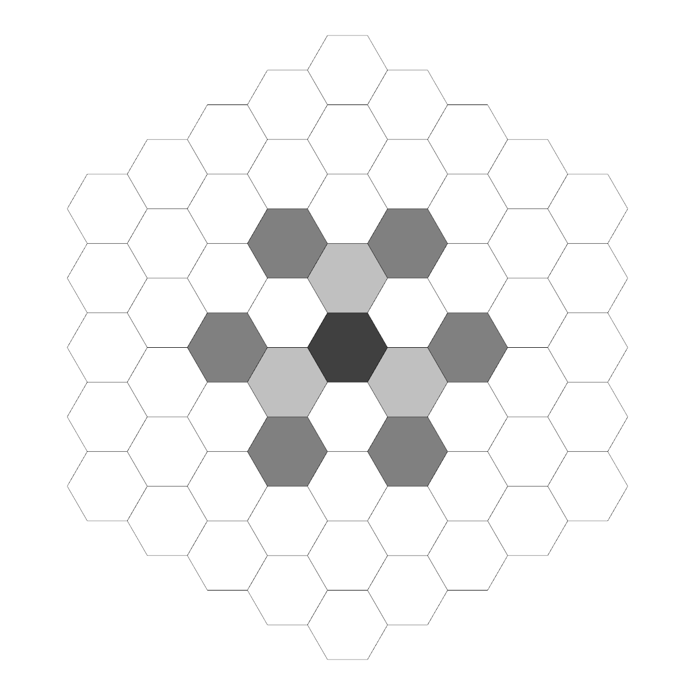

# Moves #
__( Like Jagger )__

## Preface ##

The map is a graph - a set of nodes, where each node contains a set of its neighbors.

Each node has a position in 2D space.

To make it easier to define moves, nodes will index their neighbors by direction.
This direction is stored as a number, in degrees. This number is in the interval [0, 360). Right is 0, up is 90, left is 180 and down is 270 degrees.

Nodes sort their neighbors by this direction, ascending. This is more of an implementation detail, but a notable one, because it has the potential to make implementations easier.

For example, in regular chess, we have 8x8 nodes, and most of these nodes have 4 nodes, in directions 0, 90, 180 and 270.

Moves are based on directions. At first, a direction is chosen from the node's neighbors. However, when a piece needs to move two or more steps in a given direction, the current node might not have a neighbor in that exact same direction. In this case, the piece moves onto the neighbor closest to the chosen direction. When two neighbors have the same difference in direction, the one with the lower degree is chosen.

For example, if the piece wants to move in the direction 45, but the current node has neighbors on 0 and 90, the piece will choose the neighbor with direction 0.

### Intent ###

Under the hood, the map is a graph. However, playing on arbitrary graphs could prove to be very unintuitive. Tracking each piece's moves, which nodes can they attack, which areas are safe, this becomes a mess even on a mildly chaotic graph.

For this reason, the moves will be defined for arbitrary graphs, but the game will most probably play on more regular and consistent ones. Imagine squares, hexagons, and some arbitrary shapes made out of them. A single map will contain only a single kind of polygon - e.g. no mixing of squares and hexagons.

Also, as a general rule of thumb, however the rules of nchess are defined, the goal is to support regular chess, too. If the game is played with default chessman placement on the default map, the game should play the same as regular chess. So, in a sense, these rules are generalizations of regular chess' rules.

## Pawn ##

In regular chess, defining the pawns movement is easy. It can move in a single direction, towards the other side of the map. If this is the piece's first move, it can take two steps. The pawn can move diagonally forward, to take one of the enemy's pieces, if available.

Some things should be noted:
  * The pawns are not really mobile. They can only move in a single direction.
  * Pawns can easily be blocked.
  * When blocked by another pawn, both pawns are blocked.
  * These blocks can be freed either by taking the blocking piece, or, more interestingly, by giving the pawn an enemy piece to take down.

Defining the 'other side of the map' could be highly cumbersome on some graphs.

So a simplification could be make - let the pawn move in any direction, but only a single step. This is getting close, but the blockages mentioned would not apply anymore. These are considered to be important. So, pawns are only allowed to move in a single direction.

Which one? Since determining the 'other side of the map' direction is not always applicable, the pawn can choose a direction on its first move. After that, the pawn can move only in that particular direction. Except when taking down another piece. Taking down a piece can happen in any direction, **except** the pawn's chosen direction, and the reverse of that direction ( the to a 180 degree turn ).

**Note:** This reverse direction could also mean the previous node the pawn was on.

This retains the blockages, and provides some more room for tactics.

## Rook ##

The rook can move an arbitrary amount of steps in any direction. Yes, that means curves, if the map indicates it.

__TODO__: Castling?

## Knight ##

The knight can take two steps in an arbitrary direction, then take another step in a different direction. The last step can't be taken backwards, meaning the knight can't step to the first node it moved onto in the process.

The move can't be made if the knight would land on a blocked node.

The knight is the only piece that can jump over other pieces.

## Bishop ##

The bishop moves __diagonally__. This could be cumbersome to define. But let's do it anyway!  

In regular chess, the bishop moves diagonally. This could be viewed in different ways.

Note that the smallest step a bishop can make is two fields. Making the smallest steps takes the bishop two nodes away from its original node.

Also, the bishop never moves in a single direction. That's what makes its moves diagonal.

So, we can define the bishop's destination node as two nodes away from the starting point, and by taking two different directions.

__Alternative definition:__ Take two adjacent neighbors. The intersection of these nodes' neighbors give a diagonally adjacent node. Repeat this for each pair of neighbors that are adjacent.

## Queen ##

The queen can be defined as the combination of the rook and the bishop. It can move either straight or diagonally.

## King ##

The king can move to any neighboring node, or take a diagonal step.
